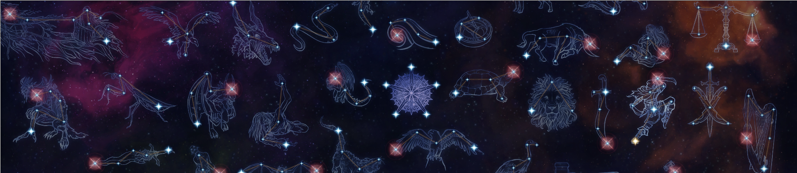

# Devotion Solver for [Grim Dawn](https://grimdawn.fandom.com/wiki/Grim_Dawn)


## Installation
The main `solve.py` requires a [Gurobi](https://www.gurobi.com/downloads/end-user-license-agreement-academic/) license to run.  All the scripts require Python 3.7 or later.

### Using `virtualenv`
After cloning the repo, run this from the directory of this file: 
```bash
virtualenv venv
pip install -r requirements.txt
source venv/bin/activate
```


## Usage
Grim Dawn's Devotion system is pretty complicated.  The `solve.py` script will:
1. Figure out the best combination of stars in to end up with, subject which bonuses you decide are important (bigger weights = more important)
2. Calculate a way to reach that final combination by adding and possible refunding constellations (refunding a few Devotion points as possible)

In the config file `example-config.toml`
```toml
# Number of devotion points available
points = 47

# Weapon types you will be using.  A star's bonuses only count if you meet the weapon requirement.
# Possible weapons types are: Dagger, Axe, Axe2h, Mace, Mace2h, Offhand, Ranged1h, Ranged2h, Shield,
# Spear, Staff, Sword, Sword2h.  See './info.py w' for descriptions.
weapons = ['Offhand', 'Staff']

# Which celestial powers to unlock (case insensitive). Run './info.py p' for a full list
#celestial_powers = ["raise the dead", "time dilation"]
celestial_powers = ["raise the dead", "elemental seeker"]
#celestial_powers = ["elemental seeker"]

# Force these stars to be picked. Format is '[Constellation] [Index]', case insensitive; for example
# 'Revenant 0' or 'Vire the Stone Matron 5'.
stars = []


[[bonus]]
# X-Y Aether Damage
# value = 0.5 * (X + Y)
kind = "Damage.Aether"
weight = 1

[[bonus]]
# X-Y Cold Damage
# value = 0.5 * (X + Y)
kind = "Damage.Cold"
weight = 1


[[bonus]]
# X% Aether Damage
# value = X
kind = "DamageModifier.Aether"
weight = 20

[[bonus]]
# X% Cold Damage
# value = X
kind = "DamageModifier.Cold"
weight = 3

[[bonus]]
# X% Cold Damage
# value = X
kind = "DamageModifier.Fire"
weight = 1

[[bonus]]
# X% Frostburn Damage with Y% Increased Duration
# value = X + Y
kind = "DamageOverTimeModifier.Cold"
weight = 5

[[bonus]]
# X% Reduced target's Elemental Resistances for Y Seconds
# value = X * Y
kind = "ResistanceReduction.Elemental"
weight = 5

[[bonus]]
# X% Energy Absorbed from Enemy Spells
# value = X
kind = "characterEnergyAbsorptionPercent"
weight = 10

[[bonus]]
# X Spirit
# value = X
kind = "characterIntelligence"
weight = 1

[[bonus]]
# X% Spirit
# value = X
kind = "characterIntelligenceModifier"
weight = 20


[[bonus]]
# X Health Regenerated per second
# value = X
kind = "characterLifeRegen"
weight = 5

[[bonus]]
# Increases Health Regeneration by X%
# value = X
kind = "characterLifeRegenModifier"
weight = 5

[[bonus]]
# X% Energy
# value = X
kind = "characterManaModifier"
weight = 25

[[bonus]]
# X Energy Regenerated per second
# value = X
kind = "characterManaRegen"
weight = 200

[[bonus]]
# Increases Energy Regeneration by X%
# value = X
kind = "characterManaRegenModifier"
weight = 40


[[bonus]]
# X-Y% of Attack Damage converted to Health
# 0.5 * (X + Y)
kind = "Damage.LifeLeech"
weight = 10

[[bonus]]
# -X% Skill Energy Cost
# value = X
kind = "skillManaCostReduction"
weight = 200

```

Running `./solve.py -c example-config.toml` will figure out the best allocation of your available Devoution points and figure out how to get there:
```
============================================== GUIDE ===============================================
Add constellations in any order
    + Crossroads (Chaos)

Add constellations in any order
    + Mantis
    + Rat

Add constellations in any order
    + Jackal
    + Owl
    + Raven
    + Scholar's Light
    + Toad

Add constellations in any order
    + Oklaine's Lantern
    + Revenant

Unlocked Stars from this point onwards
    Blind Sage
    (*) 30.0 Spirit
     |  25.0 Offensive Ability
     |  30.0 Physique
     |  
    (*) 80.0% Elemental Damage
     |  25.0 Offensive Ability
     |  15.0% Elemental Resistance
     |  
    (*) 40.0 Defensive Ability
     |  30.0% Skill Disruption Protection
     |  12.0% Crit Damage
     |  
    (*) 200.0% Frostburn Damage with 25.0% Increased Duration
     |  100.0% Cold Damage
     |  
    (*) 200.0% Burn Damage with 25.0% Increased Duration
     |  100.0% Fire Damage
     |  
    (*) Elemental Seeker
    
    Lotus
    (*) 30.0 Health
     |  100.0 Energy
     |  
    (*) 1.0 Energy Regenerated per second
     |  Increases Energy Regeneration by 15.0%
    
Remove constellations in any order
    - Crossroads (Chaos)

Unlocked Stars from this point onwards
    Wraith
    (*) 15.0% Lightning Damage
     |  15.0% Aether Damage
     |  
    (*) 24.0% Lightning Damage
     |  24.0% Aether Damage
    

============================================= SUMMARY ==============================================
Celestial Powers
Elemental Seeker              (Blind Sage)
Raise the Dead                (Revenant)

Total Bonuses [10391.0]
[   2280.0] 95.0% to All Damage
[   1800.0] 9.0 Energy Regenerated per second
[   1475.0] 250.0% Frostburn Damage with 45.0% Increased Duration
[   1260.0] 63.0% Aether Damage
[   1200.0] Increases Energy Regeneration by 30.0%
[   1000.0] -5.0% Skill Energy Cost
[    476.0] 119.0% Elemental Damage
[    300.0] 100.0% Cold Damage
[    150.0] 15.0% Energy Absorbed from Enemy Spells
[    150.0] 6.0% Energy
[    110.0] 110.0 Spirit
[    100.0] 100.0% Fire Damage
[     90.0] 9.0% of Attack Damage converted to Health
```

Each section of output must be completed in order; for example, Crossroads (Chaos), Crossroads (Eldritch) and Crossroads (Order) must all be picked before Lotus or Quill.  There are three types of section (excluding the summary at the end).  
- **Add Constellation**: Each of constellations in the group must be completed, but their order within the group doesn't matter
- **Remove Constellation**: Each of constellations in the group must be refunded, but their order within the group doesn't matter
- **Unlocked Stars**: These stars are part of constellations which are never finished.  They shown from the moment it becomes possible to choose them.  You can take them immediately, or focus on completing constellations instead.  In the example above, the star from Hyrian could have been chosen immediately, or after removing Crossroads (Chaos), or after getting Black Blood of Yugol.

The number on left in the **Total Bonuses** is the total objective value (`weight * value`) for the bonus type.

`configure.py` will create a config file for you.  For example,
```bash
./configure.py -b "fire"
```
will create a config file pre-filled with bonuses related to "fire" damage. `./info.py b` will list all bonuses.